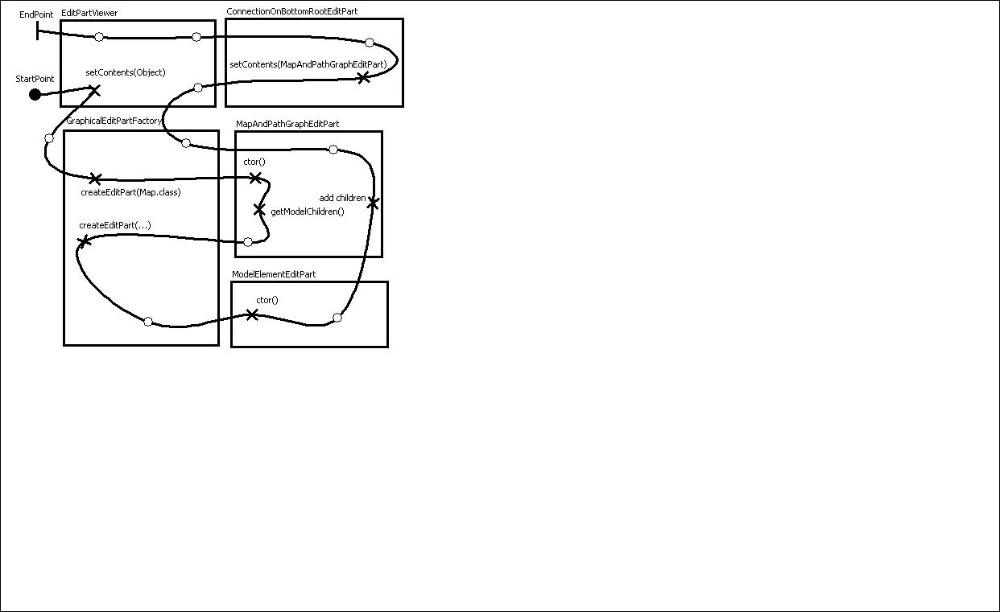

# Edit Part Creation

## Overview

As indicated in [Dev Doc UCMEditor](DevDocUCMEditor), the graphical viewer is assigned:

  - An EditPartFactory
      - seg.jUCMNav.editparts.GraphicalEditPartFactory
      - (seg.jUCMNav.editparts.treeEditparts.TreeEditPartFactory for the
        outline, the same concepts apply)
  - A RootEditPart
      - seg.jUCMNav.editparts.UCMConnectionOnBottomRootEditPart
      - (seg.jUCMNav.editparts.treeEditparts.OutlineRootEditPart for the
        outline, the same concepts apply)
  - A model element

At this time, I recommend you read
<http://eclipsewiki.editme.com/GefDescription> and
<http://eclipsewiki.editme.com/GefDescription2>. Refresh the page, the
images will appear.

## Edit Part Hierarchy

  - When a call is made to our graphical viewer's setContents() the
    following code (from the framework is invoked):

<!-- end list -->

    /**
     * @see EditPartViewer#setContents(java.lang.Object)
     */
    public void setContents(Object contents) {
       Assert.isTrue(getEditPartFactory() != null,
          "An EditPartFactory is required to call setContents(Object)");//$NON-NLS-1$
       setContents(getEditPartFactory().
             createEditPart(null, contents));
    }
    /**
     * @see EditPartViewer#setContents(org.eclipse.gef.EditPart)
     */
    public void setContents(EditPart editpart) {
       getRootEditPart().setContents(editpart);
    }
    
    /**
     * @see org.eclipse.gef.RootEditPart#setContents(org.eclipse.gef.EditPart)
     */
    public void setContents(EditPart editpart) {
       if (contents != null)
          removeChild(contents);
       contents = editpart;
       if (contents != null)
          addChild(contents, 0);
    }

  - Therefore, we ask the editpart factory for a new editpart, build
    using our model element. This new editpart is assigned as the
    contents of the root editpart.
  - The editpart factory does something like this:

<!-- end list -->

``` 
   public EditPart createEditPart(EditPart context, Object model) {
      if(model instanceof Map)
         return new UCMMapGraphEditPart((UCMmap)model);
                else if (model instanceof ...)
                        ...
```

  - How do the other editparts get created? Once created, each editpart
    is queried for model children (if not queried by the graphical
    viewer, I suppose it queries itself). The default implementation
    returns none, but one can overwrite getModelChildren().

<!-- end list -->

``` 
    protected List getModelChildren() {
        List list = getComponents();
        list.addAll(getPathNodes());
        list.addAll(getLabels());
        list.addAll(getConditions());
        return list;
    }
```

  - With this list, the caller can generate new editparts for the
    children using the editpart factory and register them in the
    editpart registry.
  - The order of the children is important; we will get back to that in
    another document. It describes the order in which the figures are
    rendered. First child -\> rendered at the back.
  - Quick fact: Any editpart knows its parent (getParent()) and the root
    edit part (getRoot()). Therefore, the root editpart is a nice
    location for state information such as the view mode (show all
    elements, hide empty points, hide empty points and stub labels).
  - Quick fact 2: Any editpart knows its viewer (getViewer()) and thus
    can obtain the editpart registry to communicate with other
    editparts. Not necessarily encouraged but can be done.
  - Obvious reminder: Any editpart is associated with a single model
    element and can obtain it using getModel().

\-- Main.JasonKealey - 24 Jun 2005

  - [DevDocEditPartCreation.jucm](att/DevDocEditPartCreation.jucm.xml):

<!-- end list -->

  - DevDocEditPartCreation-Map2-EditPartCreation.jpg: 

