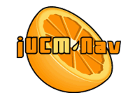

# jUCMNav: Juice up your modelling!
## [jUCMNav v7.0.0 Release Notes (Latest stable, September 9, 2016)](JUCMNavRelease700)

  -  Better support for the creation
    of feature models
  -  Aggregate contributions in goal
    models
  -  Initial support for CoURN
    (Concern-Oriented User Requirements Notation)
  -  Reusable elements in
    feature/goal models of CoURN models
  -  Evaluation of goal and feature
    models with reused elements in a CoURN model
  -  Updated URN Metamodel
  - **NOTE**: Releases 7.0.0 requires\* Eclipse 4.x. For a version
    compatible with Eclipse 3.x, please use [jUCMNav
    v5.4.0](JUCMNavRelease540)

## jUCMNav - Eclipse plugin for the User Requirements Notation

jUCMNav is a **free**, Eclipse-based graphical editor and an analysis
and transformation tool for the User Requirements Notation (URN). URN is
intended for the elicitation, analysis, specification, and validation of
requirements. URN combines two complementary views: one for goals
provided by the Goal-oriented Requirement Language (GRL) and one for
scenarios provided by the Use Case Map (UCM) notation. In addition,
jUCMNav support Feature Models, as well as the visualization of
scenarios with Message Sequence Charts \[ [More...](HelpOnLine)

 

  - [Download v7.0.0](JUCMNavRelease700)
    
  - [Requirements and Installation](DownloadingAndInstallation), with
    [Demo](InstallationDemo)
  - [jUCMNav Online Help](HelpOnLine)
  - [jUCMNav Tutorials](JUCMNavTutorials)
  - Feeling adventurous? Install our [Latest
    Build](http://jucmnav.softwareengineering.ca/ccbuilds/artifacts/seg.jUCMNav/latest/)
      - Save the .jar file to replace your
        eclipse/plugins/seg.jUCMNav\_\*.jar plug-in
  - [All Past
    Builds](http://jucmnav.softwareengineering.ca/ccbuilds/artifacts/seg.jUCMNav/)

## Developer Information

  - [jUCMNav Github Source Code Instructions](jUCMNavGithubSourceCodeInstructions)
  - [jUCMNav Developer Documentation](JUCMNavDevDoc)
  - [jUCMNav Metamodel](URNMetaModel)
  - [Key differences between the Z.151 (URN) standard and
    jUCMNav](KeyDifferences)
  - [jUCMNav Requirements](UCMNavRequirements)
  - [jUCMNav 2.0 Requirements (GRL)](JUCMNavRequirementsVer2)
  - [jUCMNav Semantics Requirements](JUCMNavSemanticsRequirements)
  - [jUCMNav Requirements
    Prioritization](JUCMNavRequirementsPrioritization)
  - [List of subjects to cover when introducing someone to the Eclipse
    development](DevelopingWithEclipse)
  - [Test Plans for jUCMNav](JUCMNavTesting)
  - [Fancy diagrams for documentation](JUCMNavFancyDiagrams)

## Subprojects

  - [GoalProcessConsistency](GoalProcessConsistency) Project 
  - [UcmScenariosToTdl](UcmScenariosToTdl) Project
  - [Aspect-oriented User Requirements Notation](AoURN) Project
  - [AoUrnToRam Transformation](AoUrnToRamWebsite) Project
  - [Feature Modeling](FeatureModeling) Project
    
  - [Legal Model Import](LegalModelImport) Project
  - [Standard URN (Z.151) Import/Export](Z151ImportExport) Project
  - [Semantic Verification and Metrics](SemanticVerification) Project
  - [Auto Layout](AutoLayout) Project
  - [DoorsExport](DoorsExport) Project
  - [UCEd Import](UCEdImport) Project
  - [Csm Export](CsmExport) Project
  - [Ucm Scenarios](UcmScenarios) Project

## Developer/User Links

  - Update Site:
    <http://jucmnav.softwareengineering.ca/jucmnav/updatesite/>
  - [jUCMNav BugZilla](http://jucmnav.softwareengineering.ca/bugzilla/)
  - [jUCMNav GitHub](https://github.com/JUCMNAV)
  - [jUCMNav statistics](http://www.eecs.uottawa.ca/~damyot/stats/) on
    [StatSVN](http://www.statsvn.org):
  - [jUCMNav statistics on
    OpenHub](http://www.ohloh.net/projects/11712?p=jUCMNav)
  - [User Requirements Notation](http://www.usecasemaps.org)
  - [URN Virtual Library](http://www.usecasemaps.org/pub)
  - [Original Software Engineering Capstone Project](SEG4910) (2005)

## External Reading Material

  - GEF Description:
    [page 1](http://eclipsewiki.editme.com/GefDescription) -
    [page 2](http://eclipsewiki.editme.com/GefDescription2)
  - [GEF + EMF red book](http://www.redbooks.ibm.com/redbooks/pdfs/sg246302.pdf)
  - [JUnit + Eclipse
    Plugins](http://today.java.net/today/2004/02/02/ch12Eclipse.pdf)
  - [SWT
    Widgets](http://www.developer.com/java/other/article.php/10936_3330861_1)
  - [Eclipse User Interface
    Guidelines](http://www.eclipse.org/articles/Article-UI-Guidelines/Contents.html)

