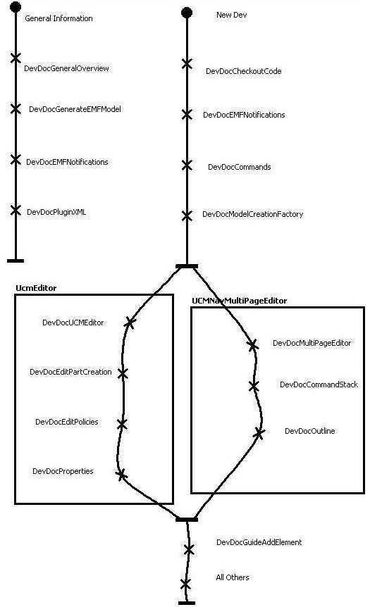

# Developer Documentation

This page contains documentation to help new developers catch onto how
jUCMNav works. Pretty much everything that is here is a must read, in my
opinion. The documentation is ordered in such a way that a neophyte
should read the documentation sequentially. We have added a small UCM to
show alternative reading tracks.

[[img/somerights20.png]]

This work is licensed Commons Attribution 2.0 Canada License.

## FAQS (predictive more than responsive)

### Environment / New Developers

#### For Starters

  - [Dev Doc General Overview](DevDocGeneralOverview): General Overview
  - [DevDocCheckoutCode](DevDocCheckoutCode): How to checkout the code and setup the project
  - [Dev Doc Coding Standards](DevDocCodingStandards): Coding Standards
  - [Dev Doc Plugin XML](DevDocPluginXML): How does Eclipse know what our plugin can do?

#### Testing-related stuff; read once before starting

  - [Dev Doc Commands](DevDocCommands): Command Structure
  - [Command Line PDEJUnit](CommandLinePDEJUnit): How to run JUnit plug-in tests from the command
    line
  - [Dev Doc Publish New Version](DevDocPublishNewVersion): Overview of how to publish a new version of
    jUCMNav.

### EMF and Low level

  - [Dev Doc How To Update Metamodel](DevDocHowToUpdateMetamodel): How to update the URN and/or CORE
    metamodels
  - [Dev Doc Generate EMFModel](DevDocGenerateEMFModel): How to generate a modified EMF model
  - [Dev Doc Model Utilities](DevDocModelUtilities): What utilities are in place to help with model
    manipulations?
  - [Dev Doc Model Creation Factory](DevDocModelCreationFactory): How do we get instances of new model
    elements?
  - [Dev Doc EMFNotifications](DevDocEMFNotifications): How do EMF notifications work?
  - [Dev Doc Meta model Documentation Update](DevDocMetamodelDocumentationUpdate): How to generate metamodel
    documentation with Rose that all browsers can read?
  - [URN MetaModel](URNMetaModel): jUCMNav's metamodel

### GEF

#### Starting Point

  - [Dev Doc Multi Page Editor](DevDocMultiPageEditor): How does the multipage editor work?
  - [Dev Doc UCMEditor](DevDocUCMEditor): How does one editor work?
  - [Dev Doc Edit Part Creation](DevDocEditPartCreation): How are the edit parts created?
  - [DevDocEditPolicies](DevDocEditPolicies): What are edit policies and how do they work?
  - [Dev Doc Figures](DevDocFigures): How do figures work?
  - [Dev Doc Palette](DevDocPalette): How does the palette work?
  - [Multi-level contextual menus in
    Eclipse/GEF](http://blog.lavablast.com/2009/06/default.aspx)

#### Extra [fluff](http://www.thebearmill.com); pretty mandatory stuff for the most part.

  - [Dev Doc Icons](DevDocIcons): How can I get access to icons?
  - [Dev Doc Command Generation](DevDocCommandGeneration): How are commands generated?
  - [Dev Doc Deletion](DevDocDeletion): How does deletion work?
  - [Dev Doc Properties](DevDocProperties): How do the properties work?
  - [Dev Doc File Management](DevDocFileManagement): How are files saved?
  - [Dev Doc Command Stack](DevDocCommandStack): How does the command stack work?
  - [Dev Doc Outline](DevDocOutline): How does the outline work?
  - [Dev Doc Context Menu](DevDocContextMenu): How does the contextual menu work?
  - [Dev Doc Connection Router](DevDocConnectionRouter): How does the connection router work?
  - [Dev Doc Wizards](DevDocWizards): How do wizards work?
  - [Dev Doc Connection On Bottom](DevDocConnectionOnBottom): How did you put some things (like
    components or paths) behind path nodes?
  - [Dev Doc Stub Dialog](DevDocStubDialog): How does the stub dialog work?
  - [Dev Doc I18n](DevDocI18n): How does the internationalization work?
      - [Internationalization And Localization in Java and
        Eclipse](InternationalizationAndLocalization)
  - [Dev Doc Actions](DevDocActions): How do actions work?

### JUCMNav Specific

#### General

  - [Dev Doc Query Infrastructure](DevDocQueryInfrastructure): How does the query infrastructure work?
  - [Dev Doc Online Help](DevDocOnlineHelp); How to update the online help and embed it in
    jUCMNav?

#### Algorithms / special cases

  - [Dev Doc Special Case Connects](DevDocSpecialCaseConnects): Special casing for Connects
  - [Dev Doc Special Case Timeout Paths](DevDocSpecialCaseTimeoutPaths): Timeout Paths
  - [Dev Doc Algo Deletion](DevDocAlgoDeletion): Deletion algorithms
  - [Auto Layout](AutoLayout) algorithm

## Extension Guides

  - [Dev Doc Plugin](DevDocPlugin): Creating a plugin for jUCMNav
    
  - [Dev Doc Import ExportExtension Points](DevDocImportExportExtensionPoints): Import/Export extension points
    
  - [Dev Doc Guide Add Element](DevDocGuideAddElement): What do I need to do to add a new UCM element
    to the tool?
  - [Dev Doc Rules And Metrics](DevDocRulesAndMetrics): What do I need to do to add new default rules
    and/or metrics to the tool?

## Quick Facts

*Quick facts that we learned during the development process that might
interest some people*

  - [Quick Eclipse Facts](Quick%20Eclipse%20Facts)
  - [Quick Eclipse + GEF + EMF dev facts](QuickEclipseDevFacts)
  - [Quick Building With Ant Facts](QuickBuildingWithAntFacts)
  - [Quick Eclipse Resources Facts](QuickEclipseResourcesFacts)
  - [Quick TWikiForms Facts](QuickTwikiFormsFacts)

## Additional reading material

  - [Gef For Dummies](GefForDummies): (French) A guide explaining our understanding of GEF
    at the start of the project.
  - [TwikiPlugins](TwikiPlugins): Potential TWiki plug-ins of interest
  - [jUCMNav on Linux on Virtual PC.](JucmnavLinux)

