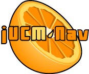

# jUCMNav v3.1.0

## Download

### Update site (recommended)

  -  See InstallationDemo
  -  Dependencies on GEF, EMF, OCL,
    and others now handled automatically through the update site.
  - In Eclipse: Help -\> Software Updates -\> Find and Install -\>
    Search for new features to install -\> New remote site:
      - Name: jUCMNav
      - URL: <http://jucmnav.softwareengineering.ca/jucmnav/updatesite/>
  - Select both the new *jUCMNav* update site **and** the *Europa
    Discovery Site*
  - **Important Notes**
      - You might need to expand the *Europa Discovery Site* before
        clicking on "Select Required" (dependencies).
      - Using the update site is needed if you want the MSC Viewer
        plugin to be installed properly. Afterwards, the jUCMNav and MSC
        Viewer plugins can be updated manually from binaries.
      - Eclipse does not allow automatic upgrades between major
        revisions. jUCMNav v2.\* will need to be uninstalled before
        proceeding with the installation of jUCMNav v3.\*

### From binaries (not recommended)

  - [Download v3.1.0
    here](http://jucmnav.softwareengineering.ca/jucmnav/artifacts/seg.jUCMNav/3.1.0/seg.jUCMNav_3.1.0.jar)
    (jar).
      - \Make sure your browser doesn't rename the .jar
        file to .zip or anything else.\</font\>
  - [Other files (src,
    javadoc)](http://jucmnav.softwareengineering.ca/jucmnav/artifacts/seg.jUCMNav/3.1.0/)
  - Download and install all prerequisites, then copy the jar file into
    your /eclipse/plugins/ directory. Restart Eclipse.
  - If you've installed jUCMNav from a latest build instead of an
    official release, make sure you remove the latest builds.

## Requirements

### Operating Systems

  - Windows XP (tested) :check:
  - Linux (tested) :check:
  - MacOS X (tested) :check:
  - Any other O/S on which you can run [Eclipse](http://www.eclipse.org)
    (currently untested - please report your success)

### JDK

  - [J2SE 5.0 (1.5)](http://java.sun.com/j2se/1.5.0/index.jsp)
  - **Note:** J2SE 6.x may cause issues with the installation and
    execution of jUCMNav.

### Eclipse

  - Version
      - jUCMNav 3.1 requires Eclipse 3.3
  - Distributions
      - We recommend the installation of Eclipse Classic 3.3.x available
        at <http://www.eclipse.org/downloads/>
  - Plug-ins required for running jUCMNav
      - jUCMNav 3.1 requires the Eclipse EMF, GEF, JDT, RPC, OCL, and
        Platform plugins.
      - Users should use the jUCMNav update site to get these
        dependencies automatically.
      - Otherwise, they can be obtained from the Europa Update Site or
        from their [respective
        projects](http://www.eclipse.org/projects/listofprojects.php)
  - \[Optional\] Additional plug-ins required for compiling jUCMNav
      - PDE and
        [WTP 2.0](http://download.eclipse.org/webtools/downloads/)

### GraphViz

  - GraphViz (dot) is required for the diagram autolayout feature.
  - <http://graphviz.org/Download.php>

## Release Notes

### Installation

  - For more in-depth information and a guide about installation of
    prerequisites, see DevDocDeployment.
  - For complete notes and troubleshooting, see: JUCMNavDeployment

### Help

  - End-user documentation is integrated with the Eclipse help system.
    `Access Help > Help Contents` from the Eclipse workbench, then
    select topic `jUCMNav Online Help`.
  - The latest user documentation can also be accessed via HelpOnLine

### Reporting Bugs / Usability Requests

  - Send your bug reports to \<a
    href="[mailto:jucmnav-dev@softwareengineering.ca](mailto:jucmnav-dev@softwareengineering.ca)"\><jucmnav-dev@softwareengineering.ca>\</a\>.
  - Include reproduction steps, sample .jucm files and, if applicable,
    copy-paste the error log messages.
  - If you're zealous enough, we'll create a
    [BugZilla](http://jucmnav.softwareengineering.ca/bugzilla/) account
    for you :)

### Enhancements / Fixes since 3.0.0

  -  [Verification of user-defined
    semantic
    rules](http://jucmnav.softwareengineering.ca/twiki/bin/view/ProjetSEG/SemanticVerification)
  -  [PDF/RTF report
    generation](HelpOnLine#Report_Generation)
  - Much improved HelpOnLine
  - [jUCMNav metamodel](URNMetaModel) better aligned with the draft
    [Z.151 (URN)
    metamodel](http://jucmnav.softwareengineering.ca/twiki/bin/view/UCM/DraftZ151Metamodel)
  - Upgraded the French version of jUCMNav.
  - Various bugs and UI-related issues:

| **Bug** | **Description**|
| --- | --- |
| <a href="http://jucmnav.softwareengineering.ca/bugzilla/show_bug.cgi?id=550">550</a> | Error when undoing the deletion of a GRL element |
| <a href="http://jucmnav.softwareengineering.ca/bugzilla/show_bug.cgi?id=554">554</a> | Strategies export to .csv files do not handle commas in descriptions | 
| <a href="http://jucmnav.softwareengineering.ca/bugzilla/show_bug.cgi?id=556">556</a> | In the Stub Bindings window, plug-in condition expressions' &amp;&amp; are replaced with &amp; | 
| <a href="http://jucmnav.softwareengineering.ca/bugzilla/show_bug.cgi?id=555">555</a> | Belief descriptions not duplicated properly when duplicating a GRL diagram | 
| <a href="http://jucmnav.softwareengineering.ca/bugzilla/show_bug.cgi?id=551">551</a> | Report when transforming a non-well-nested UCM | 
| <a href="http://jucmnav.softwareengineering.ca/bugzilla/show_bug.cgi?id=552">552</a> | TOC links in the on-line help refer to the TWiki site | 
| <a href="http://jucmnav.softwareengineering.ca/bugzilla/show_bug.cgi?id=535">535</a> | And/Or decomposition context menu item | 
| <a href="http://jucmnav.softwareengineering.ca/bugzilla/show_bug.cgi?id=559">559</a> | Invalid thread access when exporting a URN model without scenario definitions |
| <a href="http://jucmnav.softwareengineering.ca/bugzilla/show_bug.cgi?id=561">561</a> | Invalid default value for Preferences under Linux | 
| <a href="http://jucmnav.softwareengineering.ca/bugzilla/show_bug.cgi?id=409">409</a> | Export wizard + multi-map select | 
| <a href="http://jucmnav.softwareengineering.ca/bugzilla/show_bug.cgi?id=332">332</a> | Image export: should try to trim exported images | 
| <a href="http://jucmnav.softwareengineering.ca/bugzilla/show_bug.cgi?id=329">329</a> | Progress meters for wizards | 

### Known Issues in 3.1.0

  - Reports generated, MSC Viewer, and user documentation only available
    in English.
  - Reports do not include information on GRL elements or UCM scenario
    definitions (and MSCs)
  - Visibility of GRL contribution icons and text now can be set via
    jUCMNav's main preference page, but open editors are not
    automatically updated. You need to reload the model.
  - Deleting a map whose start point is referenced in a scenario
    definition causes saving the file to complain.
  - There are no extension points to give your own scenario/strategy
    algorithms and no UI to choose them.
  - Memory leak. With very large diagrams (30+ complex maps), you might
    only be able to open it half a dozen times before you run out of
    memory. Restart Eclipse to clean memory or increase JVM heap space
    until we find the memory leak source.

\-- Main.DanielAmyot - 02 May 2008
