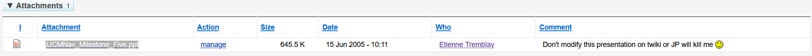

# The QA presentation is in the CVS tree.

Quality Assurance Presentation

The point of this presentation is to communicate what is being built to satisfy the customer requirements and in particular what process, environment, and mechanisms you will have in place to demonstrate and verify that the requirements are being met throughout the project lifecycle. The intention is that you should be able to measure verifiable progress throughout the project, not just at the end.

System Definition

Use diagrams (use case, deployment, package, interaction diagrams) and screen shots or UI mockups to illustrate what your system will do both from a user point of view and from an engineering point of view. This does NOT need to be a comprehensive definition and you do not need to use all possible diagrams and screen shots. Rather choose what it effective to communicate quickly the key aspects of the system that your audience needs to understand.

Identify the key requirements and critical scenarios your system must address and illustrate with example data.

Quality Assurance Strategy And Process

Define your philosophy and approach to quality assurance and identify the key types of activities you will engage in (e.g. metrics, walkthroughs, unit testing, system testing, design reviews, usability testing, white vs black box testing, code inspections etc.). Explain how and when you will integrate quality assurance into your development process and project plan.

Test Framework and Data

Define the architecture and tools of your test environment and how they are integrated into the development process for an individual developer and the build process for the system as a whole. Identify and describe the test data that you will use and how it will be created.

Test Cases and Reporting

Identify and name all the tests that will be performed on your system and organize them so that the mapping from requirements to testing is clear. The intention here is to demonstrate that you testing will verify and validate system requirements. Indicate how the results of the testing will be collected, reported and summarized in a quality assurance report and you will track and manage defects identified by testing.

Test Plan

Highlight the parts of your project plann related to testing indicating who has responsibility for testing tasks and deliverables associated with milestones. 

