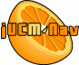

# Final Report

   - This is our final report for the software engineering capstone project.
   - As a quick note, our article for [NOTERE05](NOTERE05) has been accepted.
   - In addition, we've been informed that our tool will be used by UO and Carleton professors teaching UCMs at both the undergraduate and graduate levels.
    Furthermore, our requirements management technique (using TWiki) will be the subject of a few lectures at the graduate level, this fall. 

## Impact Assessment Report
Available under the heading: [Milestone Six Impact Assessment](MilestoneSixImpactAssessment).

## Quality Assurance Report
Report available under the heading: [Milestone Six QAReport](att/MilestoneSixQAReport.pdf)

## Project Summary
Available under the heading: [Milestone Six Project Summary](MilestoneSixProjectSummary)

System Demonstration
Demonstrations are available as annotated Flash videos. Requires the Macromedia Flash 7 plugin, available for all major browsers.

  -  Demonstration 1: [Creating a simple UCM](CreatingaSimpleUCM).
  -  Demonstration 2: [Advanced modelling](AdvancedModelling).
  -  Demonstration 3: [Path Operations](PathOperations). 

## Member Contributions
Available under the heading: [Milestone Six Member Contributions](att/MilestoneSixMemberContributions.pdf)