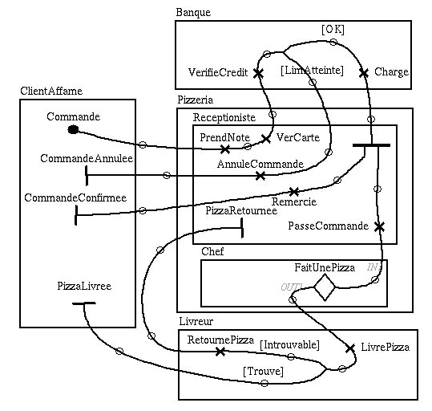

# Deliverable 2 - Analysis report

## jUCMNav – Eclipse Plugin

by         [Olivier Clift-Noël](Main.OlivierCliftNoel)    
[Jean-Philippe Daigle](Main.JeanPhilippeDaigle)     [Jason
Kealey](Main.JasonKealey)     [Jordan
McManus](Main.JordanMcManus)     [Etienne
Tremblay](Main.EtienneTremblay)     --     Team
SoftwareEngineering.Ca             

Work presented to     Dr. Liam Peyton     for the     software
engineering capstone project    

            

University of Ottawa     February 18th, 2005             

## Table of Contents

             

## Background

For our software engineering capstone project, we are developing
jUCMNav, an Eclipse Plug-in to edit and to navigate Use Case Maps. The
existing tool for manipulating this visual notation is not portable, is
far form being user friendly, and has become unmaintainable. This
document aims to define the project's requirements and features for
jUCMNav. In order to refine these requirements, we have also produced
the system's high level architecture, user scenarios, user interface
mockups, file formats and defined the main algorithms.

Note that this document assumes basic knowledge of Eclipse terminology,
and defining these words is outside the scope of our documentation
effort. See <http://www.eclipse.org> for more information.

## Requirements

### Mandatory Requirements

We have agreed to fulfill these requirements during the course of our
project: \<table width="900" border=0\>\<tr\>\<td\>
META\\:FORM.\*name\\=.\*FormForReq;\[S\]tatus.\*value\\=.\*(\[A\]pproved|\[S\]tarted|\[I\]mplemented|\[C\]ompleted);\[I\]mportance.\*value\\=.\*(\[M\]andatory);\[P\]riority.\*value\\=.\*(\[U\]rgent|\[M\]edium)
\</td\>\</tr\>\</table\>

The following requirements are also mandatory for jUCMNav but not within
the scope of our project. It would be appreciated if we implemented
these requirements but this could also be done in future projects
(extending ours): \<table width="900" border=0\>\<tr\>\<td\>
META\\:FORM.\*name\\=.\*FormForReq;\[S\]tatus.\*value\\=.\*(\[A\]pproved|\[S\]tarted|\[I\]mplemented|\[C\]ompleted);\[I\]mportance.\*value\\=.\*(\[M\]andatory);\[P\]riority.\*value\\=.\*(\[L\]ow)
\</td\>\</tr\>\</table\>

### Optional Requirements

We have agreed to complete these requirements if time permits and they
are relatively simple to implement, once our structure is in place.

\<table width="900" border=0\>\<tr\>\<td\>
META\\:FORM.\*name\\=.\*FormForReq;\[S\]tatus.\*value\\=.\*(\[A\]pproved|\[S\]tarted|\[I\]mplemented|\[C\]ompleted);\[I\]mportance.\*value\\=.\*(\[O\]ptional)
\</td\>\</tr\>\</table\>

### Goals

We will take into consideration the following requirements and goals
into consideration while designing the system, as they might impact some
of our decisions. However, our efforts in this direction will not be
evaluated. \<table width="900" border=0\>\<tr\>\<td\>
META\\:FORM.\*name\\=.\*FormForReq;\[S\]tatus.\*value\\=.\*(\[A\]pproved|\[S\]tarted|\[I\]mplemented|\[C\]ompleted);\[I\]mportance.\*value\\=.\*(\[F\]uture)
\</td\>\</tr\>\</table\>

## Example Data and Scenarios

Throughout this report, you will see examples referring to *The Pizza
UCM*. As we are building the new version of an existing tool, we are
fortunate to have access to a library of existing Use Case Map models.
The ideas embodied in them and their representation within the current
tool will serve as a proving ground for our implementation.

This UCM, describing pizza ordering and preparation, is to be used as a
concrete example for proof of concept screenshots and sample designs.
Specifically, the contents of the pizza UCM will be used to explain the
different views offered by our application, illustrate the use of an
editor window, and explain file formats.

The Pizza UCM:

## Use Case Model or Functional Features of System

### Common Information

As a single-user graph editing application, our use cases need only
consider a single actor: an end user editing UCMs.

The astute reader will notice not all requirements are addressed by this
collection of use cases - indeed, only high and medium priority
requirements marked as MANDATORY are considered, as most OPTIONAL and
FUTURE requirements are likely to only be relevant in future versions.
Still, some of these have been included where clearly appropriate.
Additionally, to prevent explosion of complexity, only main use cases
defining core functionality are included in the current section.

%ATTACHURL%/jucmnav\_UseCases\_v3.png

### Definition of common use cases

(Note that \* will be used to indicate OPTIONAL or FUTURE requirements)

### Open UCM File

Addressing: ReqOpen, ReqOpenOldDTD\*

Preconditions:

  - A project is open in the Package Explorer, and it contains at least
    one UCM diagram. No UCMs are currently loaded in editors.
  - The UCM Eclipse perspective is loaded.

Steps:

  - User double-clicks on UCMFILENAME.UCM in the Package Explorer
  - System opens the UCM in a new tabbed editor, focusing on the first
    tab (first diagram) in the file.

Notes:

  - May offer the chance to switch to the UCM perspective if it is not
    already opened.

\

### Save UCM File

Addressing: ReqSave, ReqSaveAs, ReqSaveSchema

Preconditions:

  - A UCM file is open in an editor and its model contains unsaved
    changes.
  - The UCM's editor is the currently active editor.

Steps: \* User clicks the **save** button in the main Eclipse workbench
toolbar. \* System saves the UCM to disk and grays out the save button.

Notes:

  - Keyboard accelerators for this action are provided. (CTRL+S)

### Export as graphics

Addressing: ReqExportBitmap, ReqExportSVG**, ReqExportEPS**

Preconditions:

  - A project is open in the Package Explorer, and it contains at least
    one UCM diagram.
  - File is either closed or open with no unsaved changes.

Steps:

  - User pulls up the context menu for a UCM diagram in the project.
  - User selects **Export**.
  - jUCMNav presents a menu of export destinations.
  - User selects **UCM Graphic Export**.
  - jUCMNav presents a wizard for exporting as a vector or raster
    graphics format.
  - User selects appropriate options and clicks **Finish**.
  - jUCMNav saves the UCM's diagram(s) as graphics file(s).

Notes:

  - **Export** action also available from the Workbench's **File** menu,
    and then applies to currently active UCM.

### Create UCM File

Addressing:

Preconditions:

  - A project is open in the Package Explorer.

Steps:

  - User pulls up the context menu for the project in the Package
    Explorer.
  - User selects `New > Use Case Map`
  - jUCMNav shows a wizard page asking for the diagram's name,
    description and location.
  - User inputs UCM name and clicks Finish.
  - jUCMNav creates a blank UCM file in the project, and opens it a new
    editor pane.

Notes:

  - Action also available from the Workbench's **File** menu.

### Modify UCM File

The following use cases all involve modification of an existing diagram
in a UCM file.

Common preconditions:

  - A project is open, active and contains at least one UCM file.
  - UCM file is open in the current editor, with one diagram focused.

#### Select / Deselect element

Applies to all UCM elements, defined here to prevent duplication.

Addressing: [ReqSelectAll](ReqSelectAll), [ReqSelectGroup](ReqSelectGroup), [ReqSelectGroupDelete](ReqSelectGroupDelete),
[ReqSelectGroupMove](ReqSelectGroupMove), [ReqSelectSingle](ReqSelectSingle), [ReqSelectUnselectAll](ReqSelectUnselectAll),
[ReqSelectUnselectOne](ReqSelectUnselectOne)

Selection steps:

  - User clicks on an element in the currently active editor tab.
  - System selects element and changes its color to indicate selected
    state.

Multi-Selection steps:

  - User ctrl+clicks on an unselected element in the currently active
    editor tab.
  - System adds element to current selection and changes its color to
    indicate selected state.

Deselection steps:

  - User clicks anywhere on the edit area background.
  - System deselects all selected elements.

Notes:

  - Additional ways of achieving element selection: click an element in
    the UCM's outline view.
  - Additional ways of achieving deselection: "Unselect all" action.
  - Additional ways of achieving deselection of a single element in a
    group: ctrl+click that element again.
  - Additional ways of achieving multiple selection: Drawing a selection
    box around elements.
  - Additional ways of achieving multiple selection: "Select all"
    action.

\

#### Create and Edit Elements

Addressing: ReqElem(.\*)

##### Create and Edit Paths

Encompassing:

  - Create / edit a path

Creation steps:

  - User selects path node creation tool.
  - User clicks in drawing area.
  - jUCMNav creates a start point where the user clicked.
  - The user moves his cursor to somewhere else, seeing a line
    connecting his cursor with the previous point.
  - The user clicks
  - jUCMNav adds an empty point where the user last clicked.
  - The process is repeated until the user right clicks or presses
    escape.
  - jUCMNav replaces the last empty point with an end point.

Edition steps:

  - The user clicks on node, holds the mouse button down and moves it
    elsewhere on the map.

##### Create and Edit Path Elements

Encompassing:

  - Create and Edit responsibility
  - Create and Edit timer
  - Create and Edit wait
  - Create and Edit static stub
  - Create and Edit dynamic stub
  - Create and Edit abort
  - Create and Edit and fork
  - Create and Edit or fork
  - Create and Edit and join
  - Create and Edit or join
  - Create and Edit failure point
  - Create and Edit timestamp

Creation Steps:

  - User selects and right-clicks on a single empty point and selects
    the 'add $ELEM' action, where $ELEM is the responsibility, static
    stub, dynamic stub, etc. to be added.
  - jUCMNav creates a new instance of that element at the pointer
    position.
  - When added, some path elements must be linked to multiple paths. If
    this is the case with $ELEM, a short path is created in order to
    ensure the validity of the use case map.

Editing Steps (changing a property):

  - User selects an element.
  - User edits a property in the element's property page.
  - jUCMNav applies the new property value to the element's display in
    the editor.

Editing Steps (moving an element):

  - User selects an element.
  - User drags the element to a new position.
  - jUCMNav updates the display to show the element at the drop
    position.

##### Create and Edit Components

Encompassing:

  - Create and Edit component
  - Create and Edit process, team and others (out of scope)

Creation Steps:

  - User drags an element from the toolbox to the editor area.
  - jUCMNav creates a new instance of that element at the drop position.

Editing Steps (changing a property):

  - User selects an element.
  - User edits a property in the element's property page.
  - jUCMNav applies the new property value to the element's display in
    the editor.

Editing Steps (moving an element):

  - User selects an element.
  - User drags the element to a new position.
  - jUCMNav updates the display to show the element at the drop
    position.

#### Delete Element

Addressing:[Req Select Group Delete](ReqSelectGroupDelete), [Req Elem](ReqElem)(.\*)

Steps:

  - User selects element to delete (see 'Select / Deselect element' use
    case).
  - User presses DELETE key.
  - System deletes element from the model and removes it from the view.

Notes:

  - Additional way of achieving element deletion: "Delete" action in
    element contextual menu.

### Testing these features

To prevent introduction of errors during development of future
iterations, we will establish a set of automated tests relying on
testing repeatability of sending known sets of commands on a UCM model,
and checking the resulting model against expected values. This sample
map (or maps) and scenarios for testing have yet to be defined (details
will be available in the timeframe of M3 & QA reports), but will consist
in the simplest UCM showing off all implemented features of the editor.

Not everything can be automated away however, and some amount of
human-computer interaction will be necessary to test that the interface
indeed behaves as required. This will be facilitated by the current
availability of the old UCMNav application, which provides a base model
for allowable operations and what must be supported to build Use Case
Maps.

## Non-Functional Features ---+++ Usability

The software must be usable by experienced software developers.
Therefore, we're not looking for extreme simplicity by the means of
dozens of wizards. We're looking for a uniform way of manipulating the
Use Case Map metamodel that follows the Eclipse user interface
guidelines. We must make the tool as usable as possible without
sacrificing efficiency. We will be carefully planning and reviewing the
sequence of actions that the user must perform in order to get his job
done. As a team who had no experience with the old tool nor the Use Case
Map notation, we will share the perspective of novice users.
Main.DanielAmyot will ensure that our tool respects the efficiency
requirements.

### Maintainability

Our application must be easily extensible and maintainable. In order to
achieve this goal, we will follow the architecture enforced by Eclipse,
GEF and EMF. Our documentation of the high level architecture of the
system will help new developers quickly target what portions of the code
they need to update. Hence, the Eclipse plugin and extension point
architecture will speed up future development but there is still a price
to pay. Developers who are not familiar with Eclipse (like us at the
start of this project) will have to surmount the steep Eclipse learning
curve before being able to contribute efficiently to the application. We
will also use coding and commenting standards to help share our
knowledge to future developers and to speed up their learning process.
Code reviews will help ensure we have followed our standards and will
help increase code clarity.

### Documentation

We must document how we extend our system so that future developers can
repeat the same process. Specific operations will be listed for common
tasks such as adding new path elements.

## High Level Architecture The choice of Eclipse as our development platform will play a big role in laying out the architecture. The main architectural decision is to use the Graphical Editing Framework (GEF) and the Eclipse Modeling Framework (EMF). Here we can see a deployment diagram of all the components that will guide our architectural choices:

[[img/modelDiagram.png ]] 
Figure 1: Deployment diagram

This view of our application is a very high level one but it gives a
very clear picture of the project.

We have agreed with our client that we will be designing and
implementing a graphical editor for the UCM (Use Case Maps) notation.
Most of the design and implementation will focus on the MVC
(Model-View-Controller) pattern so the core decisions will be based on
this pattern. The GEF and EMF frameworks are built using several other
useful patterns such as factory, proxy, iterator, chain of
responsibility, and command that will also guide us. Furthermore, our
client has specified a list of goals that probably will not manifest
themselves in the implementation, but might affect architectural
decisions.

It is not quite clear yet what meta-model we will be working with. Our
client has a great deal of experience with the UCM notation and will be
actively involved in the model design (that is, if he does not design
the whole meta-model himself, based on previous drafts). In the mean
time, we have drafted a class diagram describing a simplified
meta-model:

[[img/model.png]]
Figure 2: Model Diagram

### Discussion on the meta-model

Since we’re using EMF for the code generation of the meta-model, all the
code is automatically generated to allow the MVC controllers to listen
for model changes. This makes our job a lot easier with respect to
managing notifications between the objects. EMF generates default
notification types that can be interpreted by our controller to change
the view to represent the new model changes.

GEF provides some guidelines about the model that we should respect:

  - **The model stores all data that may be edited or viewed by the
    user.** This means that we have to store even data about the
    visualisation of the model too. For example bounds or coordinates of
    a figure. We are still trying to figure out if we want to put all
    this in the same model or separate the view model and the real
    business model in our model representation.
  - **Provide ways of persisting the model.** We have to make sure that
    when the editor is closed by the user, our model can be saved and
    reopened to restore the model afterwards.
  - **The model must remain ignorant of the view or the controller.** So
    the model can never store reference to edit parts, editor etc. Such
    reference would ruin the MVC pattern and could potentially break the
    editor as well, because of inactive figures.
  - **Provide a way for others to listen to changes in your model.**
    This is done with the EMF model in our case. All the EMF generated
    classes implements the Notifier interface that can notify listener
    of a model change.

### Discussion of the controllers

Each part of the model that has a visual representation in our editor
should have a controller that listens to model changes and to visual
representation changes (to update the model). Controllers in GEF are
called EditParts. EditParts are associated with a model element and
listen to all the changes from this part of the model. The EditPart does
not really know how to change the model; it delegates this task to edit
policies. EditParts receive requests. For example, the user wants to
create a new object in the editor. A high level "create request" is sent
to the parent EditPart of the editor. The EditPart also does not know
how to handle this so it delegates it to the appropriate registered edit
policy that knows how to handle such requests. The edit policy is then
asked to generate a command which is able to perform the required
request. In this particular case, a create command. Commands are stacked
when executed so the undo/redo mechanism is already in place for us. All
we have to do is ensure that all model changes reside a Command class
and create the commands with edit policies. Each command should keep
some information for undoing the change made on the model. Commands
should not know the existence of EditParts and editors. Commands only
know about the model and how to change it to meet some criteria.

The beauty of a model view controller pattern is that all the changes
made on the model are reflected automatically on all the editors viewing
this particular model. This way we can have multiple pages opened on the
same model but all pages will stay synchronized with the model because
of our application of the pattern. There is only one command stack for a
particular input, so this implies that even if we change the model in a
particular page and we go in another page and press undo, the model will
be changed back to the right state.

### Discussion of the view

The best way to explain the view is with an interaction diagram
describing exactly what is happening behind the scenes when the user
interacts with the jUCMNav. For the purpose of an example, we will
observe what is happening with GEF when the user wants to move a UCM
responsibility element in the editor (the view).

[[img/interaction.jpeg]]

This is a really high level description of what is really happening
internally when the user drags a figure around in the editor.

In this example, the user tries to move a responsibility in the editor.
First of all, the editor notifies the responsibility’s EditPart that the
responsibility moved in the view. The EditPart then delegates this
request to the right edit policy. An edit policy is the entity that
knows how to handle a certain type of request. In this case, this is a
move request. So the layout edit policy generates a move command. As
explained before, commands in GEF are the only object that can really
modify the model, that way the user can undo/redo his actions. Then, the
move command modifies the x and y variables of the responsibility
instance. Since the responsibility’s EditPart is registered on this
instance as an observer, the EditPart is notified right away of the
change made in the model. So now the EditPart knows that it has to
refresh the visuals in the view (the editor) because the model changed.
So it only updates the view parts that really need to be updated; like
the links between this responsibility and other nodes in the UCM graph.

## User Interface Mockup UIMockupDetailsViews

### 2\. Editor

The actual editor window will simply be a tabbed blank canvas on which
the Use Case Map is drawn and manipulated.

## File Formats

As our tool will be used to modify files that contain multiple Use Case
Map diagrams, we obviously need to discuss the persistence format.
During the early phases of development, we will be storing our files in
XMI (XML Metadata Interchange) format. Version 2.0 of this standard,
defined by the Object Management Group, is implemented by EMF, the model
framework that we will be using. Therefore, our first format for object
persistence will be in XMI 2.0.

In the future, our model will be persisted using XML, following the URN
1.0 DTD and files saved according to the UCM 0.23 DTD should be readable
as well. However, as these are optional for our project, we will not
provide the details of these formats.

This is what our pizza mockup current looks like in XMI: \

    <?xml version="1.0" encoding="ASCII"?>
    <network:Network xmi:version="2.0" xmlns:xmi="http://www.omg.org/XMI" 
      xmlns:xsi="http://www.w3.org/2001/XMLSchema-instance" xmlns:network="http:///network.ecore">
      <Nodes xsi:type="network:Component" x="76" y="148" width="128" height="316"/>
      <Nodes xsi:type="network:Component" x="274" y="41" width="491" height="142"/>
      <Nodes xsi:type="network:Component" x="278" y="215" width="486" height="319"/>
      <Nodes xsi:type="network:Component" x="276" y="567" width="491" height="123"/>
      <Nodes xsi:type="network:StartPoint" x="115" y="193" downstreamLinks="//@Links.0"/>
      <Nodes xsi:type="network:EndPoint" x="126" y="282" upstreamLinks="//@Links.16"/>
      <Nodes xsi:type="network:EndPoint" x="128" y="381" upstreamLinks="//@Links.18"/>
      <Nodes xsi:type="network:EndPoint" x="134" y="429" upstreamLinks="//@Links.32"/>
      <Nodes xsi:type="network:Responsibility" x="346" y="261" upstreamLinks="//@Links.1" downstreamLinks="//@Links.2"/>
      <Nodes xsi:type="network:Responsibility" x="408" y="247" upstreamLinks="//@Links.3" downstreamLinks="//@Links.4"/>
      <Nodes xsi:type="network:Component" x="303" y="242" width="428" height="167"/>
      <Nodes xsi:type="network:Component" x="308" y="425" width="425" height="80"/>
      <Nodes xsi:type="network:Responsibility" x="399" y="318" upstreamLinks="//@Links.14" downstreamLinks="//@Links.15"/>
      <Nodes xsi:type="network:Responsibility" x="450" y="363" upstreamLinks="//@Links.13" downstreamLinks="//@Links.17"/>
      <Nodes xsi:type="network:Responsibility" x="599" y="366" upstreamLinks="//@Links.20" downstreamLinks="//@Links.21"/>
      <Nodes xsi:type="network:Responsibility" x="396" y="143" upstreamLinks="//@Links.5" downstreamLinks="//@Links.6"/>
      <Nodes xsi:type="network:Responsibility" x="603" y="149" upstreamLinks="//@Links.9" downstreamLinks="//@Links.10"/>
      <Nodes xsi:type="network:Responsibility" x="367" y="599" upstreamLinks="//@Links.26" downstreamLinks="//@Links.27"/>
      <Nodes xsi:type="network:EndPoint" x="390" y="382" width="-1" height="-1" upstreamLinks="//@Links.29"/>
      <Nodes xsi:type="network:Responsibility" x="567" y="596" upstreamLinks="//@Links.23" downstreamLinks="//@Links.24"/>
      <Nodes xsi:type="network:Node" x="215" y="239" id="0" upstreamLinks="//@Links.0" downstreamLinks="//@Links.1"/>
      <Nodes xsi:type="network:Node" x="221" y="317" id="1" upstreamLinks="//@Links.15" downstreamLinks="//@Links.16"/>
      <Nodes xsi:type="network:Node" x="222" y="370" width="-1" height="-1" id="2" upstreamLinks="//@Links.17"
             downstreamLinks="//@Links.18"/>
      <Nodes xsi:type="network:Node" x="250" y="428" id="3" upstreamLinks="//@Links.28" downstreamLinks="//@Links.29"/>
      <Nodes xsi:type="network:Node" x="224" y="559" width="-1" height="-1" id="4" upstreamLinks="//@Links.27" 
             downstreamLinks="//@Links.28"/>
      <Nodes xsi:type="network:Node" x="168" y="602" id="5" upstreamLinks="//@Links.31" downstreamLinks="//@Links.32"/>
      <Nodes xsi:type="network:Node" x="445" y="640" id="6" upstreamLinks="//@Links.30" downstreamLinks="//@Links.31"/>
      <Nodes xsi:type="network:Node" x="466" y="614" id="7" upstreamLinks="//@Links.25" downstreamLinks="//@Links.26"/>
      <Nodes xsi:type="network:Node" x="521" y="631" id="8" upstreamLinks="//@Links.24"
             downstreamLinks="//@Links.25 //@Links.30"/>
      <Nodes xsi:type="network:Node" x="474" y="486" id="9" upstreamLinks="//@Links.22" downstreamLinks="//@Links.23"/>
      <Nodes xsi:type="network:Node" x="616" y="438" id="10" upstreamLinks="//@Links.21" downstreamLinks="//@Links.22"/>
      <Nodes xsi:type="network:Node" x="543" y="331" id="11" upstreamLinks="//@Links.12" downstreamLinks="//@Links.13"/>
      <Nodes xsi:type="network:Node" x="606" y="332" id="12" upstreamLinks="//@Links.19" downstreamLinks="//@Links.20"/>
      <Nodes xsi:type="network:Node" x="500" y="289" id="13" upstreamLinks="//@Links.11" downstreamLinks="//@Links.14"/>
      <Nodes xsi:type="network:Node" x="384" y="267" id="14" upstreamLinks="//@Links.2" downstreamLinks="//@Links.3"/>
      <Nodes xsi:type="network:Node" x="419" y="225" id="15" upstreamLinks="//@Links.4" downstreamLinks="//@Links.5"/>
      <Nodes xsi:type="network:Node" x="426" y="119" id="16" upstreamLinks="//@Links.6" 
             downstreamLinks="//@Links.7 //@Links.8"/>
      <Nodes xsi:type="network:Node" x="539" y="102" id="17" upstreamLinks="//@Links.8" downstreamLinks="//@Links.9"/>
      <Nodes xsi:type="network:Node" x="505" y="166" id="18" upstreamLinks="//@Links.7" downstreamLinks="//@Links.11"/>
      <Nodes xsi:type="network:Node" x="613" y="227" id="19" upstreamLinks="//@Links.10"    
             downstreamLinks="//@Links.12 //@Links.19"/>
      <Links source="//@Nodes.4" target="//@Nodes.20"/>
      <Links source="//@Nodes.20" target="//@Nodes.8"/>
      <Links source="//@Nodes.8" target="//@Nodes.34"/>
      <Links source="//@Nodes.34" target="//@Nodes.9"/>
      <Links source="//@Nodes.9" target="//@Nodes.35"/>
      <Links source="//@Nodes.35" target="//@Nodes.15"/>
      <Links source="//@Nodes.15" target="//@Nodes.36"/>
      <Links source="//@Nodes.36" target="//@Nodes.38"/>
      <Links source="//@Nodes.36" target="//@Nodes.37"/>
      <Links source="//@Nodes.37" target="//@Nodes.16"/>
      <Links source="//@Nodes.16" target="//@Nodes.39"/>
      <Links source="//@Nodes.38" target="//@Nodes.33"/>
      <Links source="//@Nodes.39" target="//@Nodes.31"/>
      <Links source="//@Nodes.31" target="//@Nodes.13"/>
      <Links source="//@Nodes.33" target="//@Nodes.12"/>
      <Links source="//@Nodes.12" target="//@Nodes.21"/>
      <Links source="//@Nodes.21" target="//@Nodes.5"/>
      <Links source="//@Nodes.13" target="//@Nodes.22"/>
      <Links source="//@Nodes.22" target="//@Nodes.6"/>
      <Links source="//@Nodes.39" target="//@Nodes.32"/>
      <Links source="//@Nodes.32" target="//@Nodes.14"/>
      <Links source="//@Nodes.14" target="//@Nodes.30"/>
      <Links source="//@Nodes.30" target="//@Nodes.29"/>
      <Links source="//@Nodes.29" target="//@Nodes.19"/>
      <Links source="//@Nodes.19" target="//@Nodes.28"/>
      <Links source="//@Nodes.28" target="//@Nodes.27"/>
      <Links source="//@Nodes.27" target="//@Nodes.17"/>
      <Links source="//@Nodes.17" target="//@Nodes.24"/>
      <Links source="//@Nodes.24" target="//@Nodes.23"/>
      <Links source="//@Nodes.23" target="//@Nodes.18"/>
      <Links source="//@Nodes.28" target="//@Nodes.26"/>
      <Links source="//@Nodes.26" target="//@Nodes.25"/>
      <Links source="//@Nodes.25" target="//@Nodes.7"/>
    </network:Network>

## Algorithms

Many requirements can be easily handled by the frameworks we are using
(GEF and EMF). When reading the description of a requirement, it may
seem like it would require an implementation of an algorithm, but in
fact all we need to do is extend a few classes in the framework. For
example, all the GUI work is handled by the GEF framework.

There are also many small algorithms that we will not describe here. For
example, since GEF uses the Command pattern to provide undo/redo
capabilities, we will need to implement execute(), undo() and redo()
methods for each of these commands. These methods are essentially
implementations of algorithms, but the descriptions of these algorithms
follow naturally from the description of their requirements.

[Req Goal Well Formed UCM](ReqGoalWellFormedUCM) : jUCMNav is INTENDED to ensure that only
well-formed UCMs will be constructed.

This does not need an implementation of an algorithm because of the way
jUCMNav will be built. The user will never be allowed to construct an
ill-formed UCM. If a new element must be on a path and it is not
positioned on one, we'll create the shortest path possible to
accommodate this new element.

Many requirements discuss opening, saving or exporting the model in XMI,
XML following a DTD, BMP, JPEG, SVG, and even EPS. These requirements
imply many complex algorithms. However, the scope of our project is
limited to the formats for which the algorithms are already implemented
for us: XMI, BMP, JPEG. Hopefully, we will have time to tackle the other
formats but a discussion of their algorithms is too premature for the
moment.

In conclusion, our system is not algorithm based. Because we are
developing extensions and not complex algorithms, we have the
opportunity to setup a truly iterative development process.
